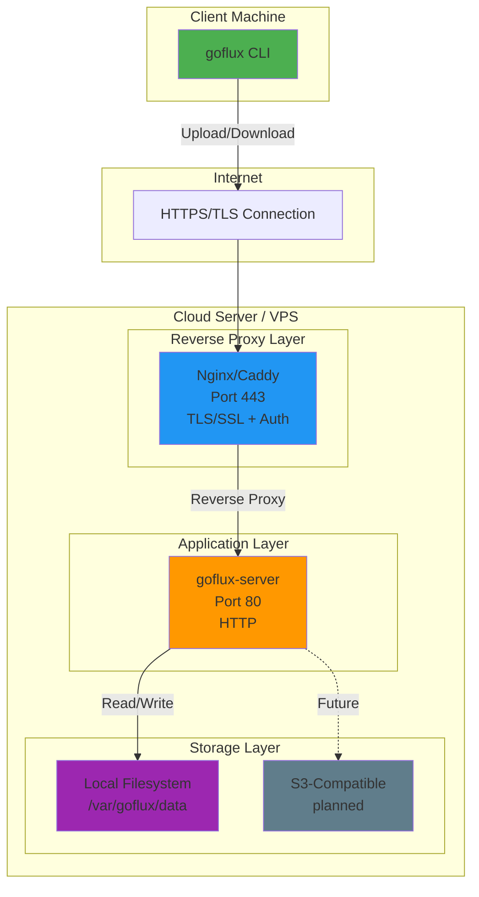
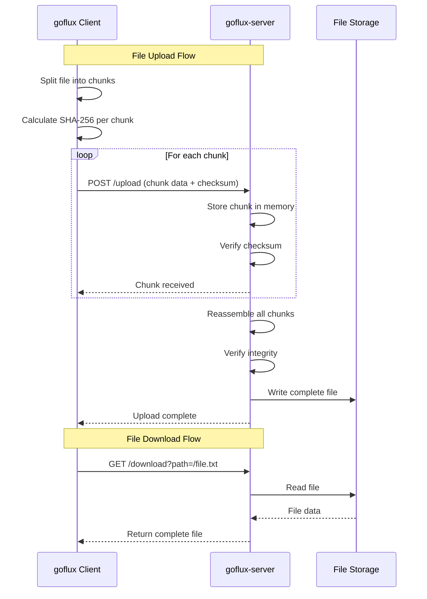
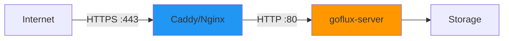
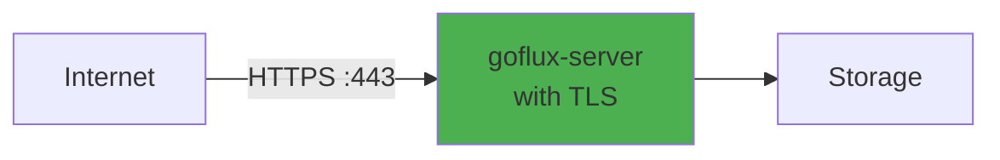
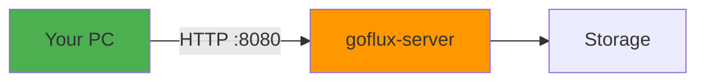
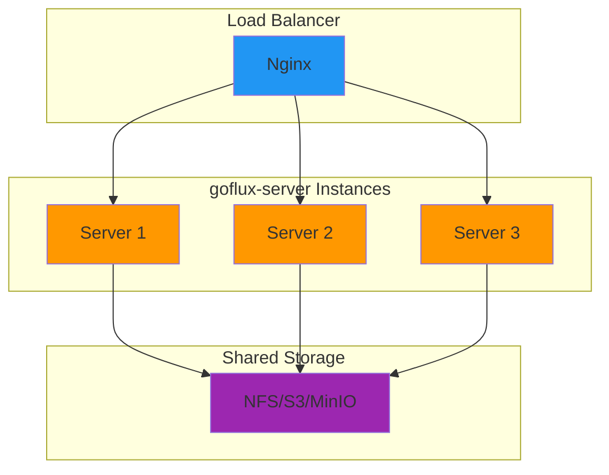

# goflux Architecture & Deployment

## Overview

goflux is designed as a client-server file transfer system with support for chunking, resumability, and multiple transport protocols.

## Production Architecture



## Current Implementation (v0.1.0)

**Local/Development Setup:**



## Transport Layers

### Current: HTTP
- ✅ Implemented
- Simple REST API
- Works on any network
- No encryption by default

### Planned: QUIC
- Better performance over lossy networks
- Built-in encryption (TLS 1.3)
- Connection migration (mobile-friendly)
- Reduced latency

### Planned: SSH
- Drop-in SFTP replacement
- Familiar authentication (SSH keys)
- Encrypted by default
- Compatible with existing SSH infrastructure

## Deployment Options

### Option 1: Behind Reverse Proxy (Recommended)



**Setup:**
```bash
# 1. Start goflux-server (local only)
./goflux-server --config goflux.json

# 2. Configure Caddy (auto HTTPS)
# Caddyfile:
your-domain.com {
    reverse_proxy localhost:80
}
```

### Option 2: Direct HTTPS (Future)



**When implemented:**
```bash
./goflux-server --addr :443 --tls-cert cert.pem --tls-key key.pem --storage /data
```

### Option 3: Local Network Only (Current)



**Usage:**
```bash
# Server
./goflux-server --addr :8080 --storage ./data

# Client
./goflux --server http://localhost:8080 put file.txt /file.txt
```

## Security Considerations

### ⚠️ Current Version (v0.1.0)

**Not recommended for internet use because:**
- ❌ No encryption (HTTP only)
- ❌ No authentication
- ❌ No access control
- ❌ No rate limiting

**Safe to use:**
- ✅ Localhost (127.0.0.1)
- ✅ Trusted private networks
- ✅ Behind VPN
- ✅ Development/testing

### 🔒 Future Security Features

**Planned for v0.2.0+:**
- 🔐 TLS/HTTPS support
- 🔑 Token-based authentication
- 👤 User management
- 📊 Access logging
- ⚡ Rate limiting
- 🔐 End-to-end encryption option

## Scalability



**For high availability:**
- Multiple goflux-server instances
- Shared storage backend (S3, NFS, MinIO)
- Load balancer in front
- Session state in external store (Redis - future)

## Network Requirements

### Firewall Rules

**Server-side:**
```bash
# Development (HTTP)
Allow TCP port 8080 from trusted IPs

# Production (with reverse proxy)
Allow TCP port 443 from anywhere
Allow TCP port 8080 from localhost only
```

### Bandwidth Considerations

**Chunk size affects:**
- Memory usage (chunks held in RAM during assembly)
- Network efficiency (smaller chunks = more HTTP overhead)
- Resume granularity (lose at most 1 chunk on disconnect)

**Recommendations:**
- LAN: 1-4 MB chunks
- Internet: 512 KB - 1 MB chunks
- High-latency/lossy: 256-512 KB chunks

## Example Production Setup

**1. Server (Ubuntu 22.04 on DigitalOcean/AWS):**
```bash
# Install goflux
wget https://github.com/0xRepo-Source/goflux/releases/download/v0.1.0/goflux-server-linux-amd64
chmod +x goflux-server-linux-amd64
sudo mv goflux-server-linux-amd64 /usr/local/bin/goflux-server

# Create systemd service
sudo nano /etc/systemd/system/goflux.service
```

```ini
[Unit]
Description=goflux File Transfer Server
After=network.target

[Service]
Type=simple
User=goflux
ExecStart=/usr/local/bin/goflux-server --addr localhost:8080 --storage /var/goflux/data
Restart=on-failure

[Install]
WantedBy=multi-user.target
```

**2. Install Caddy:**
```bash
sudo apt install -y debian-keyring debian-archive-keyring apt-transport-https
curl -1sLf 'https://dl.cloudsmith.io/public/caddy/stable/gpg.key' | sudo gpg --dearmor -o /usr/share/keyrings/caddy-stable-archive-keyring.gpg
curl -1sLf 'https://dl.cloudsmith.io/public/caddy/stable/debian.deb.txt' | sudo tee /etc/apt/sources.list.d/caddy-stable.list
sudo apt update
sudo apt install caddy
```

**3. Configure Caddy:**
```bash
sudo nano /etc/caddy/Caddyfile
```

```
files.yourdomain.com {
    reverse_proxy localhost:8080
}
```

**4. Start services:**
```bash
sudo systemctl enable --now goflux
sudo systemctl enable --now caddy
```

**5. Use from anywhere:**
```bash
./goflux --server https://files.yourdomain.com put backup.tar.gz /backups/backup.tar.gz
```

## See Also

- [README.md](../README.md) - Quick start guide
- [coreidea.md](../coreidea.md) - Design philosophy
- [CONTRIBUTING.md](../CONTRIBUTING.md) - Development guide
